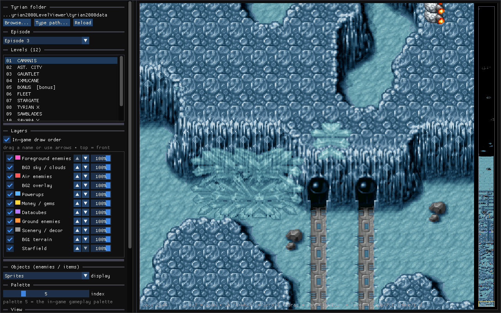
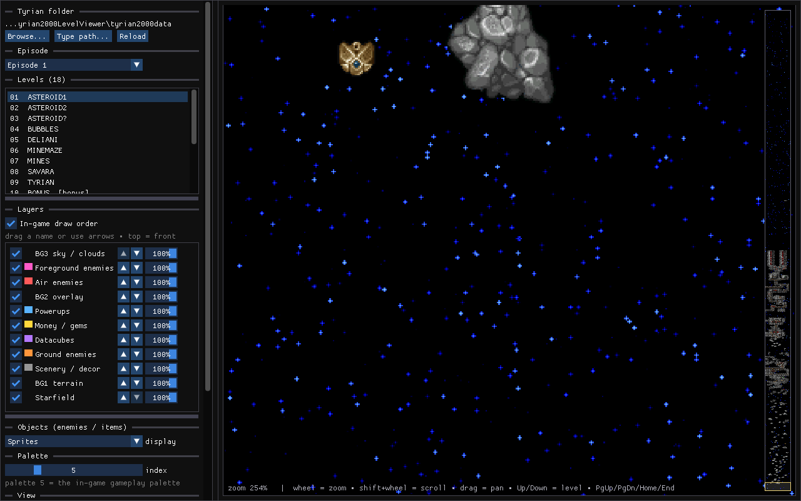

# Tyrian 2000 Level Viewer



## Features

- Episodes 1 through 5
- Every background tile drawn 1:1 from the authored maps — never stretched or
  resampled. A layer that only starts scrolling mid-level (such as an escape
  sequence) is anchored where the game introduces it, not at the level start
- Enemy, structure, pickup, datacube, and effect sprites
- Draw order derived from the level events
- Indexed BG2 blending and event-driven screen colour filters
- Manual layer ordering, visibility, and opacity
- Palette selection, zoom, pan, and tile inspection
- Minimap strip for jumping around long levels
- Object tooltips on hover (sprites and markers)
- PNG export from the app or the command line
- **Playback mode**: watch the level play out exactly like in-game — a full
  per-tick simulation of the engine's event system, enemy movement, animation,
  launches and turret fire, with the camera locked to the player's view.
  Play / pause / rewind / fast-forward, tick stepping, a scrubbable timeline
  with event markers and an enemy-density strip, plus what-if difficulty and
  scroll-speed settings



## Running

The Windows x64 release is self-contained and does not need .NET installed.

Extract the ZIP, run `Tyrian2000LevelViewer.exe`, then click **Browse...** and select your existing Tyrian 2000 folder.

The selected folder must contain `tyrian1.lvl` and `palette.dat`. The path is saved for the next launch. Game data is not included in the release.

## Building

Requires the [.NET 8 SDK](https://dotnet.microsoft.com/download/dotnet/8.0) or newer.

```powershell
dotnet run --project .\Tyrian2000LevelViewer\Tyrian2000LevelViewer.csproj --configuration Release
```

`run.cmd` runs the same command. To produce the Windows x64 release:

```powershell
.\build-release.ps1
```

Output is written to `artifacts/`.

## Controls

| Action | Input |
| --- | --- |
| Select level | **Episode** selector and **Levels** list, or **Up** / **Down** |
| Zoom | Mouse wheel over the canvas |
| Pan | Left- or middle-drag |
| Scroll quickly | **Shift**+wheel, **PageUp** / **PageDown**, **Home** / **End** |
| Jump anywhere | Click or drag the minimap strip at the right edge |
| Inspect an object | Hover it (sprites or markers) |
| Reorder layers | Drag a layer name or use the arrow buttons |
| Restore game order | Enable **In-game draw order** |
| Reset the view | **Fit width**, **1:1**, **Top**, or **Bottom** |
| Export the level | **Save level PNG...** |
| Simulate the level | Enable **Playback mode** |
| Play / pause playback | **Space** or the transport buttons |
| Step playback | **Left** / **Right** (one tick), **Shift** held = one second |
| Scrub playback | Click or drag the timeline bar |
| Rewind / fast-forward | **<<** / **>>** buttons, speed selector (x0.25–x8) |
| Zoom / pan playback | Mouse wheel / drag; **Fit** button or double-click resets |

## Command line

```powershell
# List the levels in every episode
.\Tyrian2000LevelViewer.exe --dump

# Export episode 1, level file 1, using palette 5
.\Tyrian2000LevelViewer.exe --export 1 1 5 .\exports

# Open episode index 2, level index 0
.\Tyrian2000LevelViewer.exe --start 2 0
```

Episode and level values passed to `--start` are zero-based indexes. `--export` writes a start-area crop, an object crop, and a whole-level thumbnail.

## Implementation

The file parsers are based on the formats used by [OpenTyrian](https://github.com/opentyrian/opentyrian). No conversion step or extracted asset cache is used.

| File | Contents |
| --- | --- |
| `tyrian{N}.lvl` | Level sections, events, shape maps, and tile grids |
| `levels{N}.dat` | Episode scripts and level names |
| `shapes{c}.dat` | 24 x 28 background tiles |
| `newsh*.shp`, `tyrian.shp` | Object sprites |
| `palette.dat` | VGA palettes |

The interface uses [Hexa.NET.ImGui](https://github.com/HexaEngine/Hexa.NET.ImGui) with SDL2.

This is an independent fan project and is not affiliated with the original developers or publishers.
